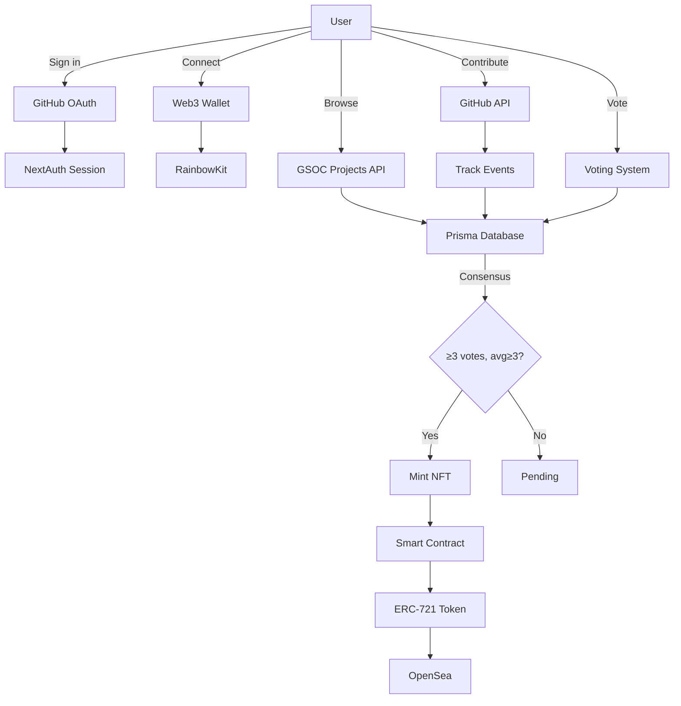

# 🎨 ContribMint

**Turn Your Open Source Contributions into Verifiable NFTs**

ContribMint is a decentralized marketplace for verified contributions to Google Summer of Code (GSOC) projects. Contribute code, get validated by peers, and mint your proof of work as an NFT.

[](https://contribbmint.vercel.app)
[](LICENSE)
[](https://nextjs.org/)

---

## 📸 Product Preview

### Homepage


### How It Works


### Platform Features


### Projects Marketplace


### 🎥 Demo Video
[Watch the full product walkthrough](/.gemini/antigravity/brain/85eef958-c062-482a-bf96-f6ff077f6400/product_demo_1768049273674.webp)

---

## 🚀 Key Features

✅ **Verified Contributions** - Cryptographically signed proof of your open-source work  
🎨 **NFT Rewards** - Mint ERC-721 tokens as on-chain certificates  
🗳️ **Peer Voting** - Decentralized quality assessment by the community  
📊 **Reputation System** - Track your impact across all projects  
🔗 **GitHub Integration** - Seamless connection to your GitHub activity  
🌍 **GSOC Projects** - Real organizations from Google Summer of Code (2022-2024)  

---

## 🛠️ Tech Stack

### Frontend
- **Next.js 15** (App Router)
- **React** with TypeScript
- **TailwindCSS** + Custom OpenSea-inspired design system
- **RainbowKit** for Web3 wallet connection
- **NextAuth.js** for GitHub OAuth

### Backend
- **Prisma** ORM with PostgreSQL (Prisma Accelerate)
- **Next.js API Routes**
- **GSOC API Integration** (`api.gsocorganizations.dev`)

### Smart Contracts
- **Solidity** (Hardhat)
- **ERC-721** NFT standard
- **Sepolia Testnet** deployment

### Infrastructure
- **Vercel** (hosting & CI/CD)
- **Prisma Accelerate** (database connection pooling)
- **GitHub API** (contribution tracking)

---

## 📖 How It Works

### 1. 🔍 Discover Projects
Browse 500+ real Google Summer of Code organizations. Filter by technology, difficulty, or topic.

### 2. 💻 Make Contributions
Submit pull requests and contribute code to open-source projects. Your GitHub activity is automatically tracked.

### 3. 🗳️ Community Votes  
Peers review and vote on the quality of your contribution (1-5 stars). **Consensus mechanism**: 3+ votes with avg ≥3 stars triggers NFT eligibility.

### 4. 🎨 Mint Your NFT
Claim an NFT proving your verified contribution. NFT contains:
- Contribution metadata
- Project information
- Community rating
- Tradeable on OpenSea

---

## 🏗️ Architecture



---

## 🚀 Getting Started

### Prerequisites
- Node.js 18+ and npm
- PostgreSQL database (or Prisma Accelerate account)
- GitHub OAuth App credentials
- WalletConnect Project ID (optional)

### Installation

1. **Clone the repository**
   ```bash
   git clone https://github.com/chetanya1998/contribbmint.git
   cd contribbmint
   ```

2. **Install dependencies**
   ```bash
   npm install
   ```

3. **Set up environment variables**
   ```bash
   cp .env.example .env
   ```
   
   Edit `.env` and add:
   ```env
   # Database (Prisma Accelerate)
   POSTGRES_PRISMA_URL="prisma+postgres://accelerate.prisma-data.net/?api_key=YOUR_KEY"
   POSTGRES_URL_NON_POOLING="postgres://..."
   
   # NextAuth
   NEXTAUTH_SECRET="your-random-secret"
   NEXTAUTH_URL="http://localhost:3000"
   
   # GitHub OAuth
   GITHUB_CLIENT_ID="your-github-client-id"
   GITHUB_CLIENT_SECRET="your-github-client-secret"
   
   # WalletConnect
   NEXT_PUBLIC_WALLETCONNECT_ID="your-project-id"
   ```

4. **Set up the database**
   ```bash
   npx prisma db push
   npx prisma db seed  # Import GSOC projects
   ```

5. **Run the development server**
   ```bash
   npm run dev
   ```

6. **Open the app**
   Navigate to [http://localhost:3000](http://localhost:3000)

---

## 📁 Project Structure

```
contribbmint/
├── app/                      # Next.js App Router pages
│   ├── page.tsx             # Homepage with How It Works
│   ├── projects/            # Projects listing & detail
│   ├── dashboard/           # User dashboard
│   ├── simulate/            # Testing simulation mode
│   ├── admin/               # Admin GSOC import UI
│   └── api/                 # API routes
├── components/              # React components
│   ├── home/               # Homepage components (StepCard, FeatureCard)
│   ├── projects/           # Project cards & search
│   └── navigation/         # Nav bar & footer
├── lib/                     # Utility libraries
│   ├── auth.ts             # NextAuth configuration
│   ├── prisma.ts           # Prisma client
│   ├── gsoc-importer.ts    # GSOC API integration
│   └── github-ingest.ts    # GitHub trending projects
├── prisma/                  # Database schema & migrations
│   ├── schema.prisma       # Prisma schema
│   └── seed.ts             # Database seeding script
├── smart-contracts/         # Solidity contracts
│   └── contracts/          # ERC-721 NFT implementation
└── public/                  # Static assets
```

---

## 🎯 Key User Flows

### New User Onboarding
1. **Land on homepage** → See "How It Works" + Features
2. **Sign in with GitHub** → Connects GitHub account
3. **Select role** → Contributor / Maintainer / Sponsor
4. **Connect wallet** → RainbowKit modal
5. **Browse projects** → Discover GSOC organizations
6. **Start contributing** → Track contributions automatically

### Contributor Journey
1. **Find project** → Filter by tech stack
2. **Make PR on GitHub** → Contribute code
3. **Contribution logged** → Event appears in dashboard
4. **Community votes** → Peers rate quality (1-5★)
5. **Consensus reached** → ≥3 votes, avg ≥3
6. **Mint NFT** → Claim proof of contribution
7. **List on OpenSea** → Trade or showcase

### Admin Flow
1. **Navigate to** `/admin/import-gsoc`
2. **Select years** (2019-2024)
3. **Preview** organizations
4. **Import** to database
5. **Projects appear** on homepage

---

## 🧪 Testing & Simulation

### Simulation Mode
For testing the full contribution lifecycle without waiting for real GitHub activity:

1. Sign in as **ADMIN**
2. Go to `/simulate`
3. **Create Event**: Fake a PR merged event
4. **Add Votes**: Instantly add 3+ votes with avg score
5. **View Result**: Check `/dashboard/contributions`
6. **Test Minting**: Click "Claim NFT"

This simulates the entire flow in seconds!

---

## 🌐 Deployment

### Vercel (Recommended)

1. **Push to GitHub**
2. **Import to Vercel**
3. **Add environment variables**:
   - `POSTGRES_PRISMA_URL`
   - `POSTGRES_URL_NON_POOLING`
   - `NEXTAUTH_SECRET`
   - `GITHUB_CLIENT_ID`
   - `GITHUB_CLIENT_SECRET`
   - `NEXT_PUBLIC_WALLETCONNECT_ID`
4. **Deploy**

The app will:
- ✅ Auto-import GSOC projects on first load
- ✅ Build successfully with all dependencies
- ✅ Connect to database via Prisma Accelerate

---

## 📊 Database Schema

### Core Models
- **User** - GitHub + wallet info, role
- **Project** - GSOC organizations, stars, forks, metadata
- **ContributionEvent** - PRs, commits, issues
- **Vote** - Community ratings (1-5 stars)
- **ProjectReputation** - Contributor points per project

### Key Fields
```prisma
model Project {
  gsocYear         Int?
  officialWebsite  String?
  chatUrl          String?
  documentationUrl String?
  source           String?  // "GSOC" or "MANUAL"
}
```

---

## 🤝 Contributing

We welcome contributions! Here's how:

1. **Fork the repo**
2. **Create a feature branch** (`git checkout -b feature/amazing-feature`)
3. **Commit changes** (`git commit -m 'Add amazing feature'`)
4. **Push to branch** (`git push origin feature/amazing-feature`)
5. **Open a Pull Request**

### Development Guidelines
- Follow TypeScript best practices
- Write meaningful commit messages
- Test locally before pushing
- Update documentation as needed

---

## 🐛 Known Issues & Limitations

- **GSOC Import**: First load triggers background import (~60s)
- **Wallet Connection**: Requires WalletConnect Project ID
- **Smart Contracts**: Currently on Sepolia testnet
- **GitHub Rate Limits**: API requests may be throttled

---

## 📝 License

MIT License - see [LICENSE](LICENSE) for details

---

## 🙏 Acknowledgments

- **Google Summer of Code** for open-source projects data
- **OpenSea** for design inspiration
- **Prisma** for excellent database tooling
- **Vercel** for seamless deployment
- **RainbowKit** for Web3 UX

---

## 📞 Contact & Support

- **Live App**: [contribbmint.vercel.app](https://contribbmint.vercel.app)
- **Issues**: [GitHub Issues](https://github.com/chetanya1998/contribbmint/issues)
- **Documentation**: See `/.gemini/antigravity/brain/*/` for implementation details

---

**Made with ❤️ for the open-source community**
